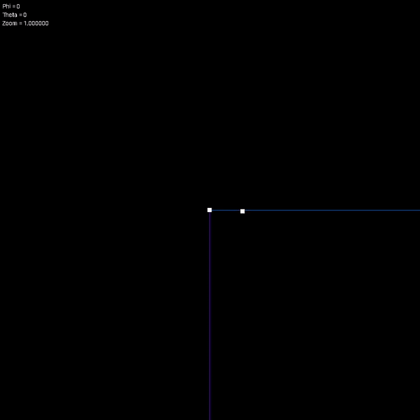

## SSF: Simple Simulation Framework

A general-purpose framework for running simple simulations. Some useful features:
- Easily swappable integration classes.
- Visualization with camera movement (i.e. zoom) using `SDL2`.

### General Structure

Suppose we wish to perform a naive N-body simulation by simply integrating the six equations
that describe a given body using Newton's Law of Gravitation (O(n^2)). This simulation would 
be defined as a `scenario` with `window`, `model`, and `integration` attributes. In our example:

- Scenario: `naive_n_body_scenario` defines the parameters of simulation and executes all relevant functions. State is stored here.
  - Model: `naive_n_body` defines the equations of evolution.
  - Window: `naive_n_body_window` defines visualization parameters, such as window size, frame rate, etc. Keyboard inputs are handled here too. 
  - Integration: `RK4` defines a 4th order Runge-Kutta method to directly integrate the scenario. 

Other useful classes include `Camera` which contains the position of the camera in space as well as the `Transform(int x,int y, int z)` function to transform coordinates into those relative to the camera. Key bindings are not defined here, as they're handled within the window class (or any derived class).

Scenarios have no base classes, but most others do. These are `model.hpp`, `window.hpp`, and `integration.hpp.`